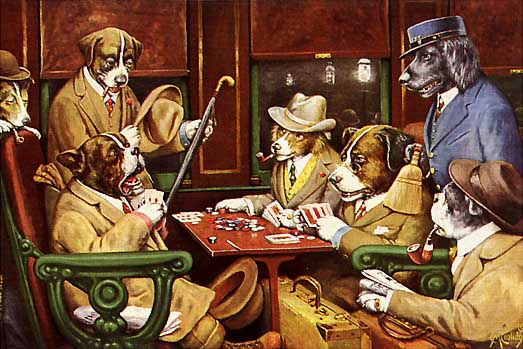

#[Poker Rule Induction](https://www.kaggle.com/c/poker-rule-induction)


##Determine the poker hand of five playing cards

Your friend bailed last minute on poker night? Before giving up on a much-needed evening of bad bluffs and quarter buy ins, light a cigar and get familiar with the rules of the game. Each record in this competition consists of five playing cards and an attribute representing the poker hand. You are asked to predict the best hand you can play based on the cards you've been dealt. 



The order of cards is important, which means there are 480 possible Royal Flush hands instead of just four. Identify those, and the other 311,875,200 possible hands correctly, and you’re in the money!

*"Isn't this easy? I know two-of-a-kind when I see it"*, you might rightfully wonder.

And you'd be right. **The intent of this challenge is automatic rules induction, i.e. to learn the rules using machine learning, without hand coding heuristics.** Pretend you are in a foreign land, have never played the game before, are given a history of thousands of games, and are asked to come up with the rules. It is potentially difficult to discover rules that can correctly classify poker hands, yet it is trivial for a human to validate the rules objectively. Remember, your algorithm will need to find rules that are general enough to be broadly useful, without being so broad that they end up being occasionally wrong. We suggest reading the [paper](http://www.wseas.us/e-library/conferences/crete2002/papers/444-494.pdf) by Cattral et al. for more background on the topic.

Playground competitions are an opportunity to build and stretch your machine learning muscles. Pull up a chair to the data science poker table and ante up.


##Data Files

You are provided with 25,010 poker hands in train.csv and 1,000,000 in test.csv. Each hand consists of five cards with a given suit and rank, drawn from a standard deck of 52. Suits and ranks are represented as ordinal categories:
```
S1 “Suit of card #1”
Ordinal (1-4) representing {Hearts, Spades, Diamonds, Clubs}
C1 “Rank of card #1”
Numerical (1-13) representing (Ace, 2, 3, ... , Queen, King)

...

S5 “Suit of card #5”
C5 “Rank of card #5”
```
Each row in the training set has the accompanying class label for the poker hand it comprises. The hands are omitted from the test set and must be predicted by participants. Hands are classified into the following ordinal categories:
```
0: Nothing in hand; not a recognized poker hand 
1: One pair; one pair of equal ranks within five cards
2: Two pairs; two pairs of equal ranks within five cards
3: Three of a kind; three equal ranks within five cards
4: Straight; five cards, sequentially ranked with no gaps
5: Flush; five cards with the same suit
6: Full house; pair + different rank three of a kind
7: Four of a kind; four equal ranks within five cards
8: Straight flush; straight + flush
9: Royal flush; {Ace, King, Queen, Jack, Ten} + flush
```
Note that the Straight flush and Royal flush hands are not representative of
the true domain because they have been over-sampled. The straight flush
is 14.43 times more likely to occur in the training set, while the royal flush is 129.82 times more likely.


##Evaluation

Submissions are evaluated on the categorization accuracy (the percent of hands that you correctly classify).


#Submission File

Your submission file should predict the hand for each id in the test set. The file should contain a header and have the following format:
```
id,hand
1,0
2,0
3,9
...
etc.
```


##Acknowledgements

Kaggle is hosting this competition for the machine learning community to use for fun and practice. This dataset was created by Robert Cattral and Franz Oppacher. We also thank the UCI machine learning repository for hosting the dataset. If you use the problem in publication, please cite:

*Bache, K. & Lichman, M. (2013). [UCI Machine Learning Repository](http://archive.ics.uci.edu/ml/). Irvine, CA: University of California, School of Information and Computer Science*